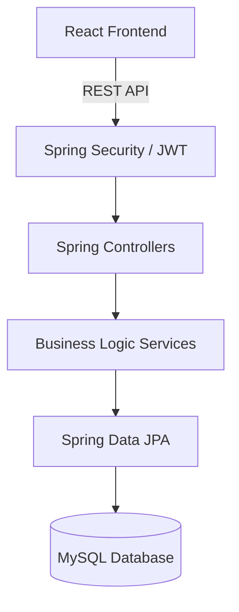
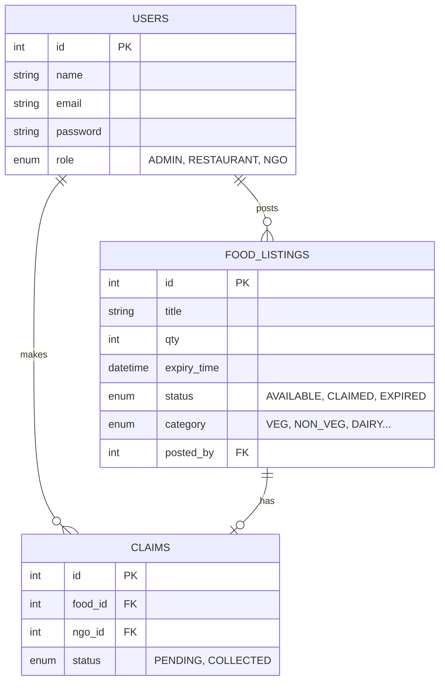
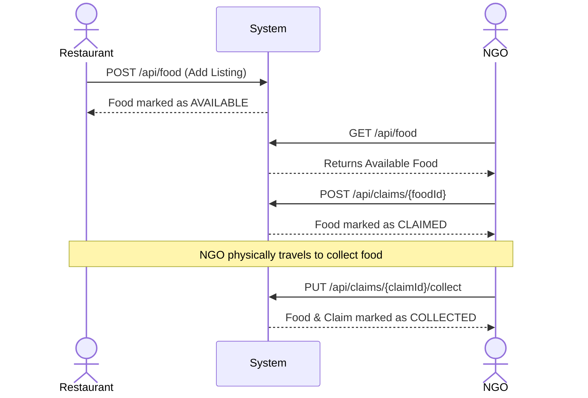

# 🍔 FoodBridge - Connecting Surplus to Scarcity

A modern, secure, and efficient platform connecting food donors with those in need. Built with Spring Boot, React, and MySQL.

**Version:** 1.0.0  
**Status:** ✅ Production Ready  

---

## 📋 Table of Contents

- [Overview](#overview)
- [🚀 Features](#-features)
- [🏗️ System Architecture](#️-system-architecture)
- [🏗️ Tech Stack](#️-tech-stack)
- [📦 Installation](#-installation)
- [⚙️ Configuration](#️-configuration)
- [🚀 Getting Started](#-getting-started)
- [📋 Database Schema](#-database-schema)
- [🔐 Authentication](#-authentication)
- [🔧 API Endpoints](#-api-endpoints)
- [🎯 Workflows](#-workflows)
- [🆘 Troubleshooting](#-troubleshooting)
- [🤝 Contributing](#-contributing)

---

## Overview

FoodBridge is a comprehensive solution designed to facilitate food donation, bridging the gap between surplus food and communities in need. It provides a secure, fast, and user-friendly experience for donors (restaurants/hotels), recipients (NGOs), and administrators.

---

## 🚀 Features

### For Restaurants & Hotels (Donors)
- **Donor Dashboard**: Donors can easily manage, post, and track their food donations.
- **Food Management**: Add new food listings, update quantities, or delete listings.
- **Real-Time Tracking**: 
  - 🟢 **Available**: Ready to be claimed
  - 🟡 **Claimed**: An NGO is on their way
  - 🔴 **Expired/Collected**: Food is no longer available

### For NGOs (Recipients)
- **Browse Food**: View a real-time list of all available food resources.
- **Secure Claim System**: Securely claim food items before they expire.
- **Collection Verification**: Mark claims as successfully collected once physically received.

### For Admin
- **System Oversight**: View all available food across the platform.
- **Content Moderation**: Delete inappropriate or expired food listings to keep the platform clean.

---

## 🏗️ System Architecture



---

## 🏗️ Tech Stack

### Frontend
- **React 19**: Modern UI library
- **Vite**: Ultra-fast frontend build tool
- **Bootstrap 5**: Responsive styling
- **Axios**: HTTP client
- **Recharts**: Data visualization

### Backend
- **Spring Boot 3**: Robust Java framework (Java 21)
- **Spring Security & JWT**: Secure authentication and authorization
- **Spring Data JPA**: Seamless database operations
- **MySQL**: Relational database
- **Swagger**: API documentation

---

## 📦 Installation

### Prerequisites

- **Java 21+** - For backend
- **Node.js 18+** - For frontend
- **MySQL 8+** - Database
- **Git** - Version control

### Backend Setup

1. **Navigate to backend**
   ```bash
   cd backend
   ```

2. **Run Backend Server**
   ```bash
   # Windows
   ./mvnw.cmd spring-boot:run
   ```
   Backend runs on: `http://localhost:8080`

### Frontend Setup

1. **Navigate to frontend**
   ```bash
   cd frontend
   ```

2. **Install dependencies and Start**
   ```bash
   npm install
   npm run dev
   ```
   Frontend runs on: `http://localhost:5173`

---

## ⚙️ Configuration

### Backend Configuration (application.properties)

Update the `backend/src/main/resources/application.properties` file with your MySQL credentials:
```env
spring.datasource.url=jdbc:mysql://localhost:3306/foodbridge
spring.datasource.username=root
spring.datasource.password=yourpassword

# JWT Secret
jwt.secret=YourSuperSecretKeyHere...
```

---

## 🚀 Getting Started

1. **Database Setup**: Start your MySQL service and ensure your credentials match.
2. **Launch Backend**: Start the Spring Boot server via the Maven wrapper.
3. **Launch Frontend**: Start the Vite development server.
4. **Access the App**: Visit `http://localhost:5173` in your browser.
5. **API Testing**: Explore the Swagger UI at `http://localhost:8080/swagger-ui.html`.

---

## 📋 Database Schema

The database uses MySQL with Spring Data JPA. Below is the Entity-Relationship representation:



---

## 🔐 Authentication

The application uses **JSON Web Tokens (JWT)** for stateless authentication.
- Users authenticate via the `/api/auth/login` endpoint.
- A JWT token is returned in the response.
- All secured endpoints require the `Authorization: Bearer <token>` header.
- Roles are strictly enforced using Spring Security's `@PreAuthorize("hasRole('...')")`.

---

## 🔧 API Endpoints

### Auth API (`/api/auth`)
- `POST /login` - Authenticate user and receive JWT
- `POST /register` - Register a new user
- `POST /logout` - Invalidate session

### Food API (`/api/food`)
- `GET /` - Get all available food (NGO/Admin)
- `POST /` - Add a new food listing (Restaurant)
- `GET /my-listings` - Get listings posted by the logged-in restaurant
- `PUT /{id}` - Update a listing
- `DELETE /{id}` - Delete a listing

### Claim API (`/api/claims`)
- `GET /` - View all claims made by the logged-in NGO
- `POST /{foodId}` - Claim a specific food listing
- `PUT /{claimId}/collect` - Mark a claimed food as successfully collected

---

## 🎯 Workflows

### Donation & Collection Flow



---

## 🆘 Troubleshooting

- **Database Connection Error**: Ensure MySQL is running on port `3306` and credentials in `application.properties` are correct.
- **CORS Errors**: If the frontend cannot communicate with the backend, verify the CORS configuration in Spring Security allows requests from `http://localhost:5173`.
- **JWT Expired**: If you receive a 401 Unauthorized, your login session has expired. Please log out and log back in.
- **Maven Build Fails**: Ensure you are using Java 21, as older versions may conflict with Spring Boot 3 dependencies.

---

## 🤝 Contributing

1. Fork the Project
2. Create your Feature Branch (`git checkout -b feature/AmazingFeature`)
3. Commit your Changes (`git commit -m 'Add some AmazingFeature'`)
4. Push to the Branch (`git push origin feature/AmazingFeature`)
5. Open a Pull Request
